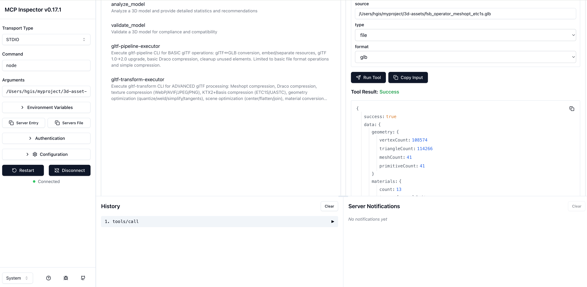

# 3D Asset Processing MCP

A comprehensive MCP server for processing, validating, optimizing, and analyzing 3D models with glTF/GLB support.

## Features

- **Analysis**: Get detailed model statistics including geometry, materials, animations, and performance metrics
- **Validation**: Ensure 3D models meet standards using built-in checks
- **Basic Processing**: Convert between glTF/GLB formats using gltf-pipeline
- **Advanced Processing**: Apply Meshopt/Draco compression, texture optimization, and geometry processing using gltf-transform

## Installation

Add to your MCP client configuration:

```json
{
  "mcpServers": {
    "3d-asset-processing-mcp": {
      "command": "npx",
      "args": ["-y", "3d-asset-processing-mcp@0.0.1-beta.5"]
    }
  }
}
```

All dependencies (gltf-pipeline, gltf-transform) are included - no additional setup required.

## Available Tools

- **`analyze_model`**: Analyze 3D models and provide detailed statistics
- **`validate_model`**: Validate 3D models for compliance and compatibility
- **`gltf-pipeline-executor`**: Basic glTF operations (conversion, format upgrade, simple compression)
- **`gltf-transform-executor`**: Advanced glTF processing (Meshopt/Draco compression, texture optimization, geometry processing)

## Development

```bash
# Clone the repository
git clone git@github.com:GeoLibra/3d-asset-processing-mcp.git
cd 3d-asset-processing-mcp

# Install dependencies
npm install

# Build the project
npm run build

# debug mcp
"3d-asset-processing-mcp": {
  "command": "node",
  "args": [
    "/Users/hgis/myproject/3d-asset-processing-mcp/dist/server.js"
  ]
}
```

## debug mcp

```bash
npx @modelcontextprotocol/inspector
```


## License

MIT
